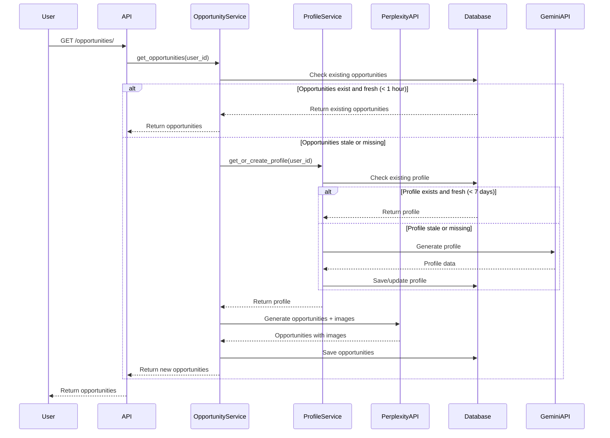

# Design Document

## Overview

The Opportunities Optimization will restructure the current system to use persistent user profiles, synchronous operations, consolidated API calls, and simplified caching. This design eliminates redundant API calls, reduces complexity, and improves user experience.

## Architecture

### Database Schema Changes

```sql
-- New UserProfile model
CREATE TABLE user_profiles (
    id SERIAL PRIMARY KEY,
    user_id INTEGER REFERENCES auth_user(id),
    profile_data JSONB NOT NULL,
    created_at TIMESTAMP DEFAULT NOW(),
    updated_at TIMESTAMP DEFAULT NOW(),
    UNIQUE(user_id)
);

-- Add profile reference to opportunities
ALTER TABLE opportunities 
ADD COLUMN profile_id INTEGER REFERENCES user_profiles(id);

-- Add created_at index for efficient querying
CREATE INDEX idx_opportunities_created_at ON opportunities(created_at);
CREATE INDEX idx_user_profiles_updated_at ON user_profiles(updated_at);
```

### Service Architecture

```
OpportunityService
├── ProfileService
│   ├── get_or_create_profile()
│   ├── update_profile()
│   └── is_profile_stale()
├── PerplexityService
│   ├── generate_opportunities_with_images()
│   └── parse_enhanced_response()
└── CacheService
    ├── get_fresh_opportunities()
    └── should_regenerate()
```

### Data Flow



## Components and Interfaces

### UserProfile Model

```python
class UserProfile(models.Model):
    user = models.OneToOneField(User, on_delete=models.CASCADE)
    profile_data = models.JSONField()
    created_at = models.DateTimeField(auto_now_add=True)
    updated_at = models.DateTimeField(auto_now=True)
    
    def is_stale(self):
        return timezone.now() - self.updated_at > timedelta(days=7)
```

### Enhanced Perplexity Prompt

```python
def create_enhanced_opportunity_prompt(profile):
    return f"""
    Based on this user profile, provide 4-6 specific financial opportunities in India.
    
    For EACH opportunity, provide:
    TITLE: [Specific title]
    CATEGORY: [category]
    PRIORITY: [high/medium/low]
    DESCRIPTION: [Details]
    AI_INSIGHTS: [Why relevant]
    ACTION_STEPS: [Steps to take]
    RELEVANCE_SCORE: [0.0-1.0]
    IMAGE_URL: [Find and provide a specific, high-quality image URL that directly relates to this opportunity. Use news images, company logos, or relevant stock photos. Must be a working URL.]
    LOGO_URL: [Company logo if applicable]
    OFFER_DETAILS: [JSON format details]
    
    Profile: {profile}
    """
```

### Simplified Service Methods

```python
class OpportunityService:
    def get_opportunities(self, user_id: int) -> List[Opportunity]:
        # Check for fresh opportunities
        existing = self._get_fresh_opportunities(user_id)
        if existing:
            return existing
            
        # Get or create profile
        profile = self.profile_service.get_or_create_profile(user_id)
        
        # Generate opportunities with images
        opportunity_data = self.perplexity_service.generate_opportunities_with_images(profile)
        
        # Save and return
        return self._save_opportunities(user_id, opportunity_data)
    
    def refresh_opportunities(self, user_id: int) -> List[Opportunity]:
        # Delete existing
        Opportunity.objects.filter(user_id=user_id).delete()
        
        # Generate new ones
        return self.get_opportunities(user_id)
```

## Error Handling

### Profile Generation Failures
- Fallback to basic profile from questionnaire responses
- Log errors but continue with opportunity generation
- Retry profile generation on next request

### Perplexity API Failures
- Use enhanced fallback opportunities with relevant images
- Implement exponential backoff for retries
- Graceful degradation to cached opportunities

### Image URL Failures
- Validate image URLs before saving
- Use category-based fallback images for invalid URLs
- Log failed image URLs for monitoring

## Testing Strategy

### Unit Tests
- ProfileService profile creation and caching
- PerplexityService enhanced prompt generation
- OpportunityService opportunity lifecycle
- Image URL validation and fallback logic

### Integration Tests
- End-to-end opportunity generation flow
- Profile persistence and retrieval
- API response formatting and error handling
- Database constraint validation

### Performance Tests
- Opportunity generation time measurement
- Database query optimization validation
- Memory usage monitoring
- Concurrent user load testing