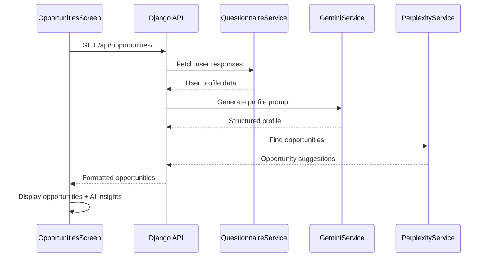

# Design Document

## Overview

The Opportunities Page Enhancement will transform the existing placeholder screen into a comprehensive AI-powered financial opportunities discovery system. The design leverages existing UI patterns from the Goals and Expenses screens while introducing new components for opportunity display and AI-powered insights generation.

The system will follow a three-stage process:
1. **Data Collection**: Fetch user questionnaire responses from the backend
2. **AI Processing**: Generate user profile using Gemini API and find opportunities using Perplexity API  
3. **Presentation**: Display opportunities in a consistent, intuitive interface with AI insights

## Architecture

### Frontend Architecture

```
OpportunitiesScreen
├── OpportunityCard (multiple)
│   ├── OpportunityHeader (icon, title, category)
│   ├── OpportunityContent (description, priority indicator)
│   └── AIInsightsSection (clickable)
├── OpportunityInsightsDrawer (reusable drawer component)
├── LoadingSpinner (during data fetch)
└── ErrorBoundary (error handling)
```

### Backend Architecture

```
Django Backend
├── /api/opportunities/ (new endpoint)
│   ├── GET: Fetch user opportunities
│   └── POST: Refresh opportunities
├── /api/questionnaire/responses/ (new endpoint)
│   └── GET: Fetch user questionnaire responses
└── OpportunityService (new service)
    ├── GeminiProfileService
    ├── PerplexityOpportunityService
    └── OpportunityProcessor
```

### Data Flow



## Components and Interfaces

### Frontend Components

#### OpportunitiesScreen
- **Purpose**: Main screen component managing state and data flow
- **Props**: None (uses navigation context)
- **State**: 
  - `opportunities: Opportunity[]`
  - `loading: boolean`
  - `refreshing: boolean`
  - `selectedOpportunity: Opportunity | null`
  - `showInsightsDrawer: boolean`

#### OpportunityCard
- **Purpose**: Display individual opportunity with consistent styling
- **Props**:
  ```typescript
  interface OpportunityCardProps {
    opportunity: Opportunity;
    onInsightsPress: (opportunity: Opportunity) => void;
  }
  ```
- **Design**: Follows Goals screen card pattern with category icons and priority indicators

#### OpportunityInsightsDrawer
- **Purpose**: Reusable drawer for detailed AI insights (extends AIInsightsDrawer pattern)
- **Props**:
  ```typescript
  interface OpportunityInsightsDrawerProps {
    visible: boolean;
    opportunity: Opportunity | null;
    onClose: () => void;
  }
  ```

### Backend Components

#### OpportunityService
- **Purpose**: Orchestrate opportunity generation process
- **Methods**:
  - `generate_opportunities(user_id: int) -> List[Opportunity]`
  - `refresh_opportunities(user_id: int) -> List[Opportunity]`

#### GeminiProfileService
- **Purpose**: Generate structured user profiles using Gemini API
- **Methods**:
  - `create_profile_prompt(user_responses: List[UserResponse]) -> str`
  - `generate_profile(prompt: str) -> UserProfile`

#### PerplexityOpportunityService
- **Purpose**: Find opportunities using Perplexity API
- **Methods**:
  - `find_opportunities(profile: UserProfile) -> List[OpportunityData]`
  - `categorize_opportunities(opportunities: List[OpportunityData]) -> Dict[str, List[OpportunityData]]`

## Data Models

### Frontend Types

```typescript
interface Opportunity {
  id: string;
  title: string;
  description: string;
  category: OpportunityCategory;
  priority: 'high' | 'medium' | 'low';
  aiInsights: string;
  actionSteps: string[];
  relevanceScore: number;
  createdAt: string;
}

interface OpportunityCategory {
  id: string;
  name: string;
  icon: string;
  color: string;
}

interface UserProfile {
  demographics: {
    age: number;
    maritalStatus: string;
    hasKids: boolean;
  };
  financial: {
    monthlyIncome: number;
    jobStability: string;
    debtSituation: string;
    emergencyFund: string;
    expenses: Record<string, number>;
  };
  goals: {
    shortTerm: string;
    longTerm: string;
  };
  personality: {
    spendingStyle: string;
    investmentComfort: string;
  };
}
```

### Backend Models

```python
class Opportunity(models.Model):
    user = models.ForeignKey(User, on_delete=models.CASCADE)
    title = models.CharField(max_length=200)
    description = models.TextField()
    category = models.CharField(max_length=100)
    priority = models.CharField(max_length=10, choices=[
        ('high', 'High'),
        ('medium', 'Medium'), 
        ('low', 'Low')
    ])
    ai_insights = models.TextField()
    action_steps = models.JSONField(default=list)
    relevance_score = models.FloatField()
    created_at = models.DateTimeField(auto_now_add=True)
    updated_at = models.DateTimeField(auto_now=True)
```

## Error Handling

### Frontend Error Handling
- **Network Errors**: Display retry button with error message
- **API Errors**: Show user-friendly error messages
- **Loading States**: Use LoadingSpinner component with contextual messages
- **Empty States**: Show message when no opportunities are available

### Backend Error Handling
- **API Failures**: Graceful degradation with fallback content
- **Rate Limiting**: Implement exponential backoff for external APIs
- **Data Validation**: Validate user responses before processing
- **Logging**: Comprehensive logging for debugging and monitoring

## Testing Strategy

### Frontend Testing
- **Unit Tests**: Test individual components with Jest and React Native Testing Library
- **Integration Tests**: Test API integration and data flow
- **UI Tests**: Test user interactions and drawer functionality
- **Error Handling Tests**: Test error states and recovery

### Backend Testing
- **Unit Tests**: Test service classes and data processing
- **API Tests**: Test endpoint functionality and response formats
- **Integration Tests**: Test external API integration with mocking
- **Performance Tests**: Test response times and rate limiting

### Test Coverage Requirements
- Minimum 80% code coverage for new components
- All error scenarios must be tested
- API integration tests with mocked responses
- UI interaction tests for drawer and card components

## UI/UX Design Specifications

### Visual Design
- **Card Design**: Follow Goals screen card pattern with rounded corners, shadows, and consistent spacing
- **Color Scheme**: Use theme context colors with category-specific accent colors
- **Typography**: Consistent with existing screens (16px titles, 14px body text)
- **Icons**: MaterialCommunityIcons for category indicators and actions

### Interaction Design
- **Pull-to-Refresh**: Standard iOS/Android pull-to-refresh pattern
- **Drawer Animation**: Smooth slide-up animation matching AIInsightsDrawer
- **Loading States**: Skeleton loading or spinner with progress indication
- **Error States**: Clear error messages with retry actions

### Accessibility
- **Screen Reader Support**: Proper accessibility labels for all interactive elements
- **Color Contrast**: Ensure WCAG AA compliance for all text and backgrounds
- **Touch Targets**: Minimum 44px touch targets for all interactive elements
- **Focus Management**: Proper focus handling for drawer navigation

### Responsive Design
- **Card Layout**: Responsive grid that adapts to different screen sizes
- **Text Scaling**: Support for system text size preferences
- **Safe Areas**: Proper handling of notches and safe areas
- **Orientation**: Support for both portrait and landscape orientations

## Performance Considerations

### Frontend Performance
- **Lazy Loading**: Load opportunities incrementally if list is large
- **Image Optimization**: Optimize category icons and images
- **Memory Management**: Proper cleanup of drawer animations and listeners
- **Caching**: Cache opportunities data to reduce API calls

### Backend Performance
- **API Rate Limiting**: Implement rate limiting for external API calls
- **Caching**: Cache user profiles and opportunities for short periods
- **Database Optimization**: Efficient queries for user responses
- **Background Processing**: Consider background job processing for heavy AI operations

## Security Considerations

### API Security
- **Authentication**: Ensure all endpoints require proper authentication
- **Input Validation**: Validate all user inputs and API responses
- **Rate Limiting**: Prevent abuse of external API services
- **Error Handling**: Don't expose sensitive information in error messages

### Data Privacy
- **User Data**: Ensure user questionnaire data is handled securely
- **API Keys**: Secure storage and rotation of external API keys
- **Logging**: Avoid logging sensitive user information
- **Compliance**: Ensure compliance with data protection regulations