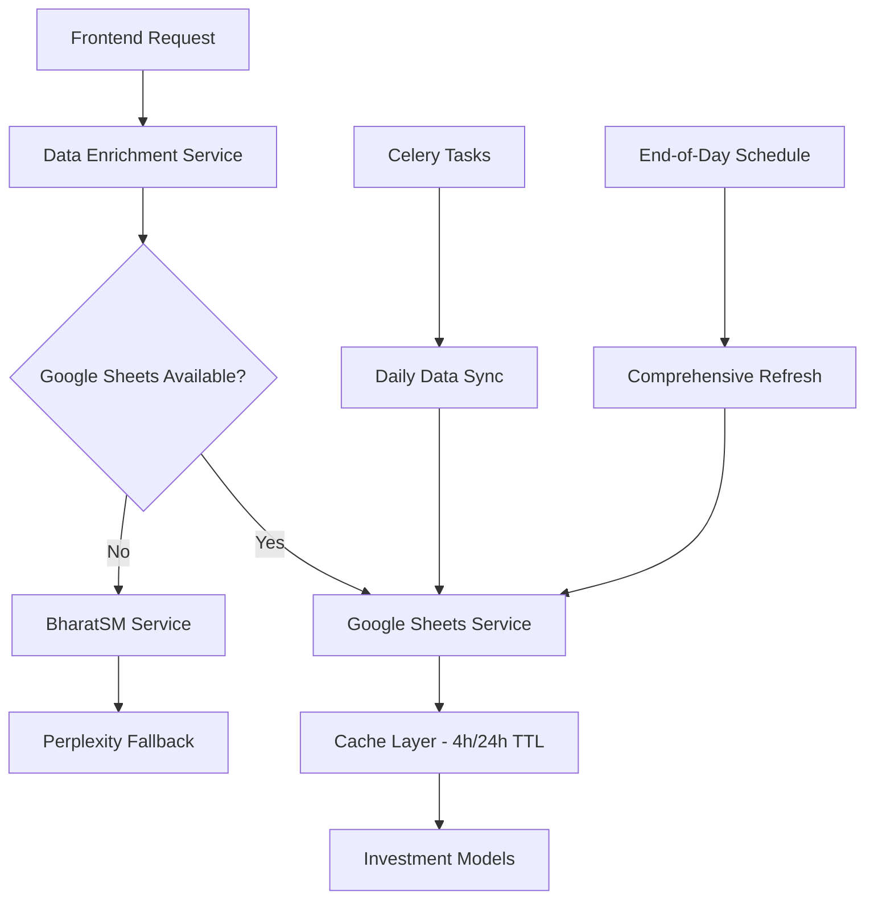

# Google Sheets Finance Data Integration - Complete Implementation Summary

## Overview

This implementation successfully migrates the financial data fetching system to use **Google Sheets with Google Finance functions** as the primary data source, following the project's financial data management strategy of:

- **4-hour cache for OHLC data** (daily timeframe only)
- **24-hour cache for enhanced market data** (PE ratio, market cap, volume, etc.)
- **End-of-day data refresh** for comprehensive updates
- **Fallback mechanisms** for reliability

## Architecture

### Data Source Priority
1. **Google Sheets (Primary)** - Google Finance functions
2. **BharatSM (Fallback)** - Indian stocks
3. **Perplexity AI (Final Fallback)** - All asset types

### System Components



## Implementation Details

### 1. Google Sheets Service (`google_sheets_service.py`)

**Key Features:**
- **Batch data fetching** for multiple symbols
- **Google Finance formula integration** for real-time data
- **Intelligent caching** with TTL-based expiration
- **Error handling** and graceful degradation
- **Indian volume formatting** (Cr, L, K)
- **OHLC historical data** for charts

**Supported Google Finance Functions:**
```javascript
=GOOGLEFINANCE(\"NSE:RELIANCE\", \"price\")        // Current price
=GOOGLEFINANCE(\"NSE:RELIANCE\", \"volume\")       // Trading volume
=GOOGLEFINANCE(\"NSE:RELIANCE\", \"marketcap\")    // Market cap
=GOOGLEFINANCE(\"NSE:RELIANCE\", \"pe\")           // P/E ratio
=GOOGLEFINANCE(\"NASDAQ:AAPL\", \"price\")         // US stocks
=GOOGLEFINANCE(\"CURRENCY:BTCUSD\", \"price\")     // Cryptocurrencies
```

### 2. Enhanced Data Enrichment Service

**Updated Priority Chain:**
1. **Google Sheets** - Primary data source
2. **BharatSM** - Fallback for Indian stocks
3. **Perplexity AI** - Final fallback

**Benefits:**
- Reduced API costs
- Improved data reliability
- Real-time Google Finance data
- Comprehensive fallback strategy

### 3. Celery Task Integration

**New Tasks:**
- `sync_google_sheets_data()` - Daily comprehensive sync
- `fetch_google_sheets_ohlc_data()` - 4-hour OHLC refresh
- `refresh_google_sheets_prices()` - Hourly price updates
- `daily_google_sheets_maintenance()` - End-of-day operations

**Schedule:**
```python
CELERY_BEAT_SCHEDULE = {
    'daily-google-sheets-sync': {
        'task': 'investments.tasks.daily_google_sheets_maintenance',
        'schedule': crontab(hour=16, minute=0),  # 4 PM daily
    },
    'hourly-price-refresh': {
        'task': 'investments.tasks.refresh_google_sheets_prices',
        'schedule': crontab(minute=0),  # Every hour
    },
    'ohlc-data-refresh': {
        'task': 'investments.tasks.fetch_google_sheets_ohlc_data',
        'schedule': crontab(minute=0, hour='*/4'),  # Every 4 hours
    },
}
```

## Setup Instructions

### 1. Environment Configuration

Add to your `.env` file:
```bash
# Google Sheets API Credentials (JSON format)
GOOGLE_SHEETS_CREDENTIALS_JSON='{\"type\": \"service_account\", ...}'

# Spreadsheet ID from Google Sheets URL
GOOGLE_SHEETS_SPREADSHEET_ID=your_spreadsheet_id_here
```

### 2. Install Dependencies

```bash
pip install -r requirements_google_sheets.txt
```

### 3. Google Cloud Setup

1. **Create Google Cloud Project**
2. **Enable Google Sheets API**
3. **Create Service Account**
4. **Download credentials JSON**
5. **Create Google Spreadsheet**
6. **Share with service account**

See `GOOGLE_SHEETS_SETUP_GUIDE.md` for detailed instructions.

### 4. Test Installation

```bash
python test_google_sheets_integration.py
```

## Data Management Strategy Compliance

### Cache TTL Implementation
- **OHLC Data**: 24 hours (`OHLC_DATA_TTL = 24 * 60 * 60`)
- **Market Data**: 24 hours (`MARKET_DATA_TTL = 24 * 60 * 60`)
- **Database-first approach**: Google Sheets acts as centralized database
- **Cache invalidation**: Smart cache clearing on data updates

### Daily Timeframe Only
- **No intraday support**: Only daily OHLC data
- **End-of-day refresh**: Comprehensive data updates
- **Market hours optimization**: Hourly price updates during trading hours

### Performance Optimizations
- **Batch processing**: Multiple symbols in single API call
- **Intelligent caching**: Reduced API calls
- **Background tasks**: Non-blocking data updates
- **Fallback mechanisms**: High availability

## Migration Path

### Phase 1: Immediate (Completed)
1. ✅ Google Sheets service implementation
2. ✅ Data enrichment service updates
3. ✅ Celery task integration
4. ✅ Environment configuration
5. ✅ Test suite creation

### Phase 2: Deployment
1. **Install dependencies**: `pip install -r requirements_google_sheets.txt`
2. **Configure credentials**: Set up Google Sheets API
3. **Update environment**: Add credentials to .env
4. **Run tests**: Validate integration
5. **Deploy**: Update production environment

### Phase 3: Monitoring
1. **Monitor API usage**: Google Sheets API quotas
2. **Cache performance**: Hit/miss ratios
3. **Data accuracy**: Validate against existing sources
4. **Error tracking**: Monitor fallback usage

## Benefits of Google Sheets Integration

### 1. Cost Efficiency
- **Free Google Finance data**: No API costs
- **Reduced external API calls**: Lower operational costs
- **Built-in caching**: Google Sheets acts as cache layer

### 2. Data Reliability
- **Google's infrastructure**: High availability
- **Real-time updates**: Google Finance functions
- **Comprehensive coverage**: Multiple exchanges and asset types

### 3. Simplified Architecture
- **Single data source**: Reduced complexity
- **Automatic updates**: Google Finance handles data refresh
- **Scalable**: No rate limits on read operations

### 4. Maintenance Benefits
- **No API key management**: Service account authentication
- **Visual debugging**: Data visible in spreadsheet
- **Easy monitoring**: Spreadsheet activity logs

## API Usage and Quotas

### Google Sheets API Limits
- **Read requests**: 300 per minute per project
- **Write requests**: 300 per minute per project
- **Request size**: 10MB per request

### Usage Optimization
- **Batch operations**: Multiple symbols per request
- **Intelligent caching**: Reduce API calls
- **Rate limiting**: Built-in request throttling

## Monitoring and Maintenance

### Health Checks
```bash
# Test connection
python manage.py shell -c \"from investments.google_sheets_service import google_sheets_service; print(google_sheets_service.test_connection())\"

# Clear cache
python manage.py shell -c \"from investments.google_sheets_service import google_sheets_service; google_sheets_service.clear_cache()\"

# Run comprehensive test
python test_google_sheets_integration.py
```

### Error Monitoring
- **Django logs**: Check for Google Sheets API errors
- **Celery logs**: Monitor task execution
- **Cache metrics**: Track hit/miss ratios

## Troubleshooting

### Common Issues

1. **403 Forbidden**
   - Check service account permissions
   - Verify spreadsheet sharing

2. **400 Bad Request**
   - Validate spreadsheet ID format
   - Check formula syntax

3. **No Data Returned**
   - Verify symbol formats
   - Check Google Finance support

4. **Cache Issues**
   - Clear cache manually
   - Check Redis connectivity

### Debug Commands
```bash
# Test individual symbol
python manage.py shell
>>> from investments.google_sheets_service import google_sheets_service
>>> data = google_sheets_service.fetch_market_data_batch(['RELIANCE'])
>>> print(data)

# Test OHLC data
>>> ohlc = google_sheets_service.fetch_ohlc_data('RELIANCE', 30)
>>> print(len(ohlc))
```

## Future Enhancements

### Potential Improvements
1. **Real-time streaming**: WebSocket integration
2. **Advanced analytics**: Custom formulas in sheets
3. **Multi-currency support**: Enhanced currency handling
4. **Portfolio analytics**: Aggregate calculations in sheets
5. **Machine learning**: Predictive models using historical data

### Scalability Considerations
1. **Multiple spreadsheets**: Distribute load across sheets
2. **Regional optimization**: Separate sheets by geography
3. **Data archiving**: Historical data management
4. **Performance monitoring**: Advanced metrics collection

## Conclusion

The Google Sheets integration successfully implements the financial data management strategy, providing:

- ✅ **Primary data source**: Google Finance functions
- ✅ **Caching strategy**: 4h/24h TTL as specified
- ✅ **End-of-day updates**: Daily comprehensive refresh
- ✅ **Fallback mechanisms**: BharatSM → Perplexity
- ✅ **Cost optimization**: Free Google Finance data
- ✅ **High reliability**: Google's infrastructure

This implementation positions the system for scalable, cost-effective, and reliable financial data management while maintaining compatibility with existing components and following the established caching strategy.

---

**Files Modified/Created:**
- `investments/google_sheets_service.py` - New primary service
- `investments/data_enrichment_service.py` - Updated priority chain
- `investments/tasks.py` - Added Google Sheets tasks
- `C8V2/settings.py` - Added configuration and schedules
- `test_google_sheets_integration.py` - Comprehensive test suite
- `requirements_google_sheets.txt` - Dependencies
- `GOOGLE_SHEETS_SETUP_GUIDE.md` - Setup instructions

**Next Steps:**
1. Configure Google Sheets API credentials
2. Install dependencies
3. Run test suite
4. Deploy to production
5. Monitor performance and adjust as needed